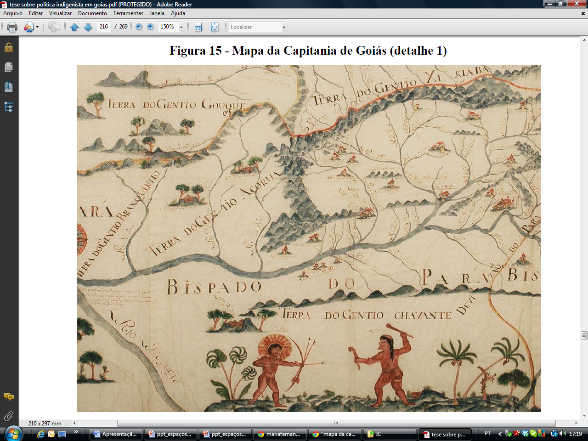
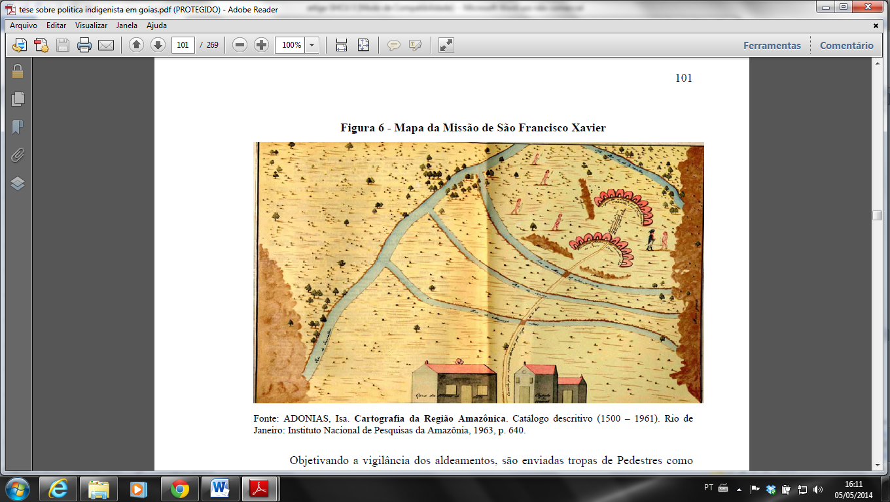
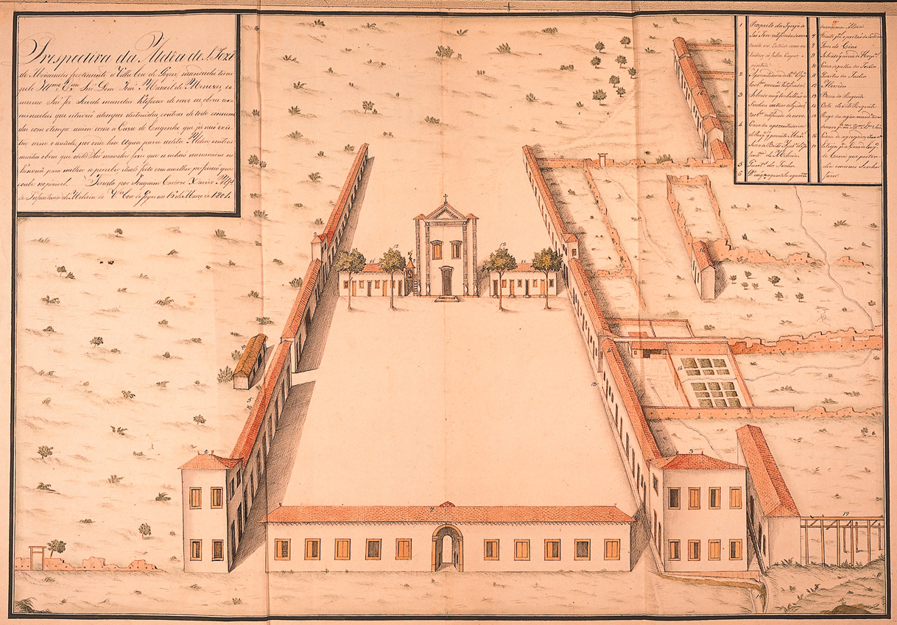
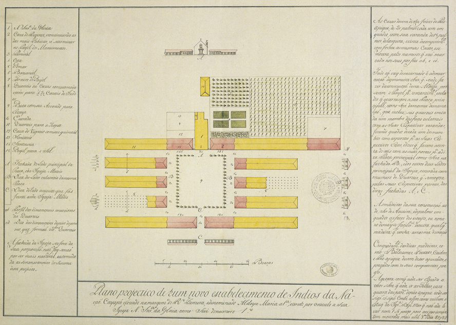
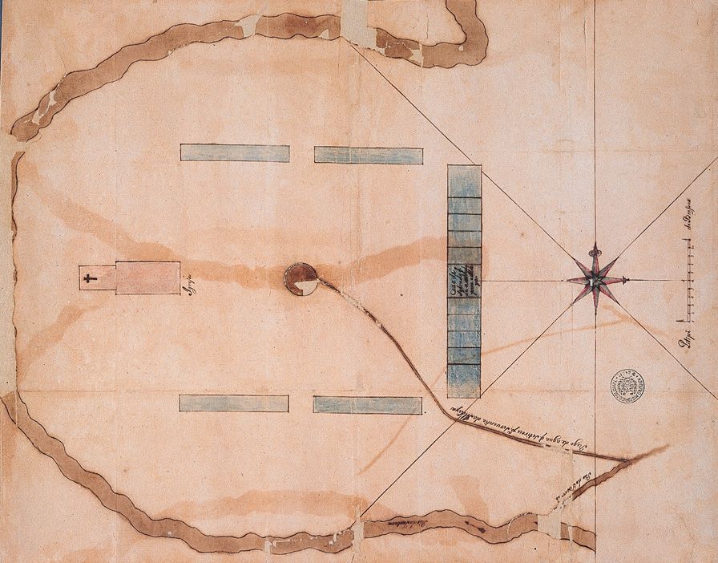

## Resumo

## Nas primeiras décadas do século 18, dezenas de arraiais de mineração pontilharam uma porção central e ainda escassamente ocupada da América portuguesa. A elevação do arraial de Santana a Vila Boa em 1739 e a instalação de governo autônomo na capitania de Goiás em 1749 foram parte das medidas iniciais para incorporação daquela região aos territórios do Império português. Este trabalho concentra-se, porém, num período menos estudado da história de Goiás, a segunda metade do século 18. Pretende-se ir além das imagens de isolamento e decadência que marcaram a historiografia goiana sobre o período pós-mineração, buscando-se discutir a participação da capitania em políticas territoriais mais amplas. Para isso, retomaram-se documentos escritos e mapas coevos, com base na bibliografia pertinente. A análise permitiu destacar o estabelecimento de aldeamentos indígenas como instrumento de gestão daqueles territórios; já numa escala local, foi possível identificar interações diversas entre autoridades, índios e colonos envolvidos na produção de espaços dos aldeamentos.

## Palavras-chave: formação territorial, Goiás, século 18, aldeamentos indígenas, urbanização

## Abstract

At the heart of Portuguese America: indian settlements and the formation
of territories in the captaincy of Goiás

Over the first decades of the eighteenth century, dozens of mining camps
dotted a central and still sparsely occupied portion of Portuguese
America. The granting of town-status Vila Boa to the camp of Santana in
1739 and the installation of self-government in the captaincy of Goiás
in 1749 were part of the initial steps for incorporating that region to
the territories of the Portuguese Empire. This paper focuses, however, a
less studied period in the history of Goiás, the second half of the 18th
century. It intends to go beyond the images of isolation and decay that
marked the Goiás historiography on post-mining period, and tries to
discuss the participation of the captaincy in broader territorial
policies. For this, written documents and coeval maps were resumed,
based on apropos literature. The analysis has highlighted the
establishment of indigenous settlements as a management tool in those
territories; in turn, in a local scale, it was possible to identify
several interactions among authorities, Indians and settlers involved in
the production of spaces in the settlements.

Key-words: territorial formation, Goiás, 18th century, indigenous
settlements, urbanization

"Este Goiás está metido no coração da América portuguesa, não é marinha
nem fronteira" observou em 1762 o governador e capitão-general João
Manuel de Melo. (apud RIHGB, 1918, p. 86). A capitania de Goiás, na
parte central dos territórios, estava distante tanto das regiões de
ocupação mais antiga no litoral como da zona fronteiriça ameaçada pelos
espanhóis. Por isso, reclamava o governador João Manuel, não lhe seria
possível participar dos combates aos espanhóis. Ele teria de se resignar
a uma guerra que considerava menos honrosa, aquela contra os "tapuias"
-- assim se designava o índio não submetido ao colonizador, "o
traiçoeiro selvagem, obstáculo no caminho da civilização" (MONTEIRO,
2001, p. 30). Desde as primeiras décadas do século 18, quando aquela
região passou a ser mais valorizada pelo processo de colonização, houve
contínuos e violentos confrontos com os grupos indígenas que ali
habitavam. A criação de aldeamentos indígenas foi não apenas uma maneira
de lidar com esses conflitos, mas também instrumento fundamental de
políticas territoriais num contexto de reafirmação da soberania
portuguesa na América do Sul.

A historiografia de Goiás toma como marco inicial da colonização a
expedição que partiu de São Paulo em 1722, sob comando do sertanista
Bartolomeu Bueno da Silva, o II Anhanguera, com a finalidade de
descobrir minerais preciosos naqueles sertões. Um regimento régio do
mesmo ano orientou sobre como conduzir a expedição, deu a Bartolomeu
Bueno a prerrogativa de conceder sesmarias e recomendou persuadir
pacificamente os índios a se fixarem em aldeamentos. (apud DOCUMENTOS
INTERESSANTES, 1901). Mas, em caso de resistência armada, os sertanistas
poderiam reagir matando os nativos ou capturando-os para serem vendidos
em São Paulo. Durante todo o século 18, as autoridades da capitania
mantiveram um discurso contraditório sobre os índios, admitindo tanto a
necessidade de aldeá-los de modo pacífico como a imposição da guerra
justa (KARASCH, 2005).

Nas décadas de 1720, 30 e 40, os arraiais de mineração multiplicaram-se
em Goiás, agrupando-se junto ao rio Tocantins e seus afluentes,
inicialmente no centro-sul da capitania, depois mais ao norte (CHAIM,
1974, PALACÍN; GARCIA; AMADO, 2001; ROCHA, 2001). Já em 1735 uma junta
de autoridades reunidas em São Paulo recomendou criação de capitania
autônoma em Goiás, desmembrada de São Paulo, e a elevação em vila dos
arraiais de Santana e Vila Boa. A principal preocupação era de natureza
fiscal. A criação de aldeamentos não foi citada.

A elevação de uma vila significava sancionar a posse portuguesa daqueles
espaços. Em 1736, uma carta régia determinou ao governador da capitania
de São Paulo e Minas do Ouro, Antônio Luis de Távora, conde de Sarzedas,
escolher "sítio mais a propósito para uma vila\... perto de algum
arraial que se ache já estabelecido"(APUD santos, 2008, P. 61). Na
decisão sobre o local onde instalá-la, mobilizaram-se argumentos
relativos à situação no território. A escolha do arraial de Santana para
sediar a nova vila suscitou protestos, alegando-se que Meia Ponte teria
"clima mais saudável e de melhores águas" além de ser "o pião de todas
estas Minas, onde se endireitam os principais caminhos de São Paulo,
Minas Gerais e Sertão"; havia, por outro lado, o argumento da maior
antiguidade de Santana: "o arraial mais antigo e estabelecido" (apud
PALACÍN; GARCIA; AMADO, 2001, p. 46). Mas questões de ordem política
também devem ter interferido. Pode-se cogitar a intenção por parte da
Coroa de moderar os poderes de Bartolomeu Bueno nesse arraial (QUADROS,
2008).

Vila Boa, erigida em 1739, manteve-se como única sede de Concelho em
Goiás no século 18. Em outras regiões da América portuguesa, porém, o
período foi de impulso à urbanização e apenas sob D. José I (1750-1777),
estima-se a elevação de cento e trinta e quatro vilas (DERNTL; CARVALHO,
2010). Talvez se temesse que a proliferação de Câmaras trouxesse mais
chances de desobediência, como advertiu o governador do Rio de Janeiro
por ocasião da partida do conde de Sarzedas para Goiás em 1736 (VIDAL,
2009). Do ponto de vista dos homens ligados ao governo de Vila Boa, a
exclusividade do título era garantia de jurisdição sobre todo o espaço
da capitania, centralizando a arrecadação de rendimentos e mantendo-a
como cabeça de uma rede urbana (LIMA, 2011). A permanência de Vila Boa
como única vila em Goiás em todo o século 18 explica-se também pela
existência de uma rede administrativa complementar com sede em arraiais.
Já na década de 1730 definiu-se em Goiás uma organização específica
baseada na criação de dois juízes ordinários em arraiais que se tornaram
assim cabeças de julgados, onde haveria funções parciais de
administração e justiça (LIMA 2011; LEMES 2012). Em 1783, havia quarenta
e um arraiais na capitania, dos quais doze, além de Vila Boa, eram sede
de julgados; havia, além disso, uma rede eclesiástica compreendendo
vinte freguesias, duas delas sediadas em aldeamentos indígenas (BERTRAN,
2010).

Já em meados do século 18 as jazidas de Goiás deram sinal de
esgotamento. Depois do auge da exploração mineradora, imagens de
isolamento, decadência e ausência de vida urbana foram a tônica de
escritos de funcionários da Coroa e registros de viajantes,
reiterando-se em relatórios de presidentes de província e memórias e,
mais tarde, incorporando-se à historiografia. Tais imagens foram
revistas como estratégias discursivas e simbólicas ligadas a uma busca
de estímulo oficial à agricultura, à pecuária e ao comércio com outras
capitanias, sobretudo a partir da década de 1780 (CHAHUL, 2001;
MARCONDES, 2011; GARCIA, 2010). Mais do que apenas um período de
declínio da mineração, pode-se ver, desde meados do século 18, mudanças
na gestão dos territórios de Goiás.

# Uma capitania dos novos tempos

Em meio às tensões do processo de demarcação de fronteiras com os
espanhóis, já nos anos anteriores à assinatura do Tratado de Madri
(1750), a Coroa portuguesa buscou ampliar e reforçar as estruturas
administrativas, judiciárias e militares nos territórios da Colônia. A
criação das capitanias de Goiás e Mato Grosso foi parte das medidas de
estruturação da zona fronteiriça a oeste, com intenção de garantir a
posse sobre regiões de soberania indefinida. Um parecer do Conselho
Ultramarino de 1748 justificou sua criação referindo-se ao Mato Grosso
como "antemural" do interior do Brasil e à necessidade de defender as
áreas de mineração, sem deixar de citar a intenção de reagir ao gentio
"bárbaro" (apud BOAVENTURA 2007, p. 128). Goiás, desmembrada de
capitania de São Paulo em 1744, deveria dar apoio estratégico e servir
de escala comercial ao Mato Grosso (LIMA, 2011). As circunscrições
eclesiásticas também foram revistas. Em 1745, os imensos territórios do
bispado do Rio de Janeiro (1676), que se estendiam até o rio da Prata,
foram desmembrados em mais quatro partes, dando origem a dois bispados,
com sedes em São Paulo e Mariana e a duas prelazias, com sedes em Goiás
e Cuiabá. {width="5.027777777777778in"
height="3.763888888888889in"}

Figura 1: fragmento do Mapa *Capitania de Goiás*. Ca. 1750. Fonte:
APOLINÀRIO, 2005, p. 216.

Como mostrou Javã Pinheiro Marcondes (2011), novos postulados passaram a
orientar a gestão do território de Goiás: em 1730, impôs-se a Estrada
Real a partir de São Paulo como caminho único; já na segunda metade dos
setecentos, iria se firmando a ideia de um território com comunicações
abertas entre seus núcleos e com outras partes da colônia, em
articulação com uma política mais efetiva de fixação de populações.
Reconhecia-se a capitania como espaço de articulação, sobretudo entre as
capitanias do Rio de Janeiro, São Paulo, Minas Gerais, Mato Grosso e
Bahia. Nesse contexto de revisão dos instrumentos de gestão do
território, os aldeamentos indígenas tornaram-se a principal iniciativa
de estabelecimento de núcleos populacionais.

Nos primeiros tempos da colonização, o projeto jesuítico de criação de
comunidades de índios aldeados para aculturação e evangelização dos
nativos apresentou-se conveniente à Coroa e aos colonos como forma
regulada de acesso a terras e mão de obra indígena. Em Goiás, porém, a
construção de aldeamentos iniciou-se apenas na década de 1740.[^1] E ali
não houve demanda considerável pela utilização da mão de obra indígena
(LIMA, 2010).

Distinguem-se dois momentos na política de aldeamentos goianos.
Inicialmente, foram estimulados pela Coroa portuguesa e organizados na
maioria por sertanistas, com intenção de garantir a segurança de áreas
ocupadas pela mineração ou tributárias dela, além de constituir bases de
apoio às expedições de combate aos índios. Nesse primeiro momento,
aproximadamente entre 1740 e 1750, os aldeamentos situaram-se em regiões
limítrofes da capitania, junto a caminhos de acesso ao território
goiano: ao sul, próximos da Estrada Real proveniente de São Paulo; a
nordeste, nas proximidades das estradas de acesso ao Piauí, Maranhão e
ao rio São Francisco (BOAVENTURA, 2007; CHAIM, 1974; LIMA, 2010,
MARCONDES, 2011, RAVAGNI, 1987). Entre 1750 e 1774, não se fizeram novos
aldeamentos em Goiás, o que tem sido associado a um tempo de incertezas
quanto à política indigenista (MARCONDES, 2011) ou à crise da mineração
(RAVAGNI, 1987).

Em 1758 o Diretório dos Índios foi estendido a toda a colônia. Esse
conjunto de medidas legais reforçou disposições anteriores sobre o fim
da escravidão indígena e inovou ao impor a secularização do governo dos
índios. Na nova condição de vassalo português, o índio deveria ser útil
à ocupação de regiões fronteiriças e à composição de tropas militares
necessárias à defesa do território. O Diretório estabeleceu que
aldeamentos até então sob tutela de ordens religiosas fossem convertidos
em vilas e lugares. Deveriam também passar a apresentar feições e
estrutura de povoações civis, além de ter toponímia de origem
portuguesa. (BELLOTTO, 1988, KANTOR, 2006).

Em 1771, instruções régias ao governador e capitão-general de Goiás D.
José de Almeida Vasconcelos Soveral e Carvalho, depois barão de
Mossâmedes (1772-1778) fizeram referência direta ao índio como povoador:
"achando-se todo o sertão daquele vasto continente \[de Goiás\] coberto
de índios, estes deviam ser principalmente os que povoassem os lugares,
as vilas e as cidades que se fossem formando" (apud ALENCASTRE, p. 246).
Enfatizaram também que deveria ser seguido o Diretório dos Índios. O
estabelecimento de aldeamentos tornava-se então importante instrumento
na gestão daqueles territórios.

Nos aldeamentos construídos em Goiás a partir da década de 1770,
impuseram-se medidas definidas pelo Diretório para trato dos índios e
organização da vida da comunidade. A magnitude desses novos núcleos era
muito maior do que os anteriores: Nova Beira reuniu oitocentos indios
javaé e karajá; São José de Mossâmedes chegou a abrigar oito mil índios
de diversas nações (CHAIM, 1983). A intenção era criar, em Mossâmedes,
um "estabelecimento regular e permanente", concebido como "universidade
aos que se quisessem aldear" (apud ALENCASTRE, p. 306) ou seja, um
aldeamento modelo, que poderia ser supervisionado de perto a partir de
Vila Boa.

Os aldeamentos da primeira fase, de 1741 a 1750, situaram-se em regiões
limítrofes de Goiás, a sudeste e a nordeste. Posteriormente, de 1774 a
1788, situaram-se no entorno da região pioneira de expansão do
povoamento a partir de Vila Boa e numa região ainda pouco ocupada do
noroeste da capitania. Aldeamentos desse novo período parecem ter um
sentido territorial mais evidente. Nova Beira e o presídio de São Pedro
do Sul (uma base de guarnição militar), ambos na ilha de Bananal,
mostraram preocupação em aprimorar a circulação ao norte da capitania e
estabelecer ligações pelo Araguaia e Tocantins com o Grão-Pará, apesar
do interdito régio nesse sentido (MARCONDES, 2011, RAVAGNI, 1987). E uma
intenção do aldeamento de Maria I era permitir à capitania "alargar-se"
para aquela parte (apud RIHGB, 1918, p. 141-142).

A configuração e o propósito dos aldeamentos desse período mostram
também novas orientações.

# A construção dos aldeamentos

A comparação entre processos de implantação de aldeamentos a partir da
década de 1770 mostra procedimentos similares. Inicialmente, expedições
conduzidas por sertanistas escolhidos pelo governador, denominadas
bandeiras, eram incumbidas de fazer os contatos com os índios e
conduzi-los ao aldeamento. As expedições utilizaram tanto da violência
como de meios persuasivos, por vezes contando com índios pacificados
para intermediar os contatos. Houve confrontos e resistências por parte
dos índios, mas também se fizeram alianças e negociações (KARASCH, 2005;
APOLINÁRIO, 2005).

O governador barão de Mossâmedes afirmou ter ele mesmo cuidado da
eleição do sítio para o aldeamento de São José de Mossâmedes. Depois de
viajar várias vezes a Serra Dourada em busca de "situação
proporcionada", escolheu "uma paragem agradável de campo, boas águas e
muitos matos" (apud ALENCASTRE, p. 306). Também o governador Tristão da
Cunha escolheu o sítio para o aldeamento de Carretão (apud ALENCASTRE,
p. 331). Por sua vez, o governador Luis da Cunha Meneses teria ordenado
aos índios que escolhessem o sítio de Maria I. O local eleito, à margem
de um rio a 14 léguas de Vila Boa, foi aprovado pelo governador por
várias razões, entre elas permitir a fixação agrícola, estar perto de
rio piscoso e de uma fazenda de gado que também servia a Mossâmedes e
ainda pela proximidade de Vila Boa, o que permitiria cuidar melhor de
seu desenvolvimento (apud RIHGB, 1918, p. 141-2).

O problema da subsistência inicial dos índios poderia ser decisivo para
a escolha do sítio. Ainda na primeira fase de estabelecimento dos
aldeamentos, o governador Dom Marcos Noronha solicitou à Coroa, sem
sucesso, auxílio durante um ano para manutenção dos dois núcleos então
existentes ao norte, até que as roças estivessem prontas e pudessem se
sustentar (apud APOLINÁRIO, 2005, p. 102). O governador seguinte, Dom
Álvaro José Xavier Botelho de Távora, Conde de São Miguel (1755-1759),
denunciou um acordo para que um daqueles aldeamentos -- provavelmente
São José do Duro(Formiga) -- se situasse junto ao arranchamento de
Venceslau Gomes da Silva. Esse administrador teria desperdiçado o gado e
o milho para abastecimento do núcleo e ainda venderia mantimentos à
Fazenda Real (apud RIHGB, 1918, p. 47). Por sua vez, a escolha do sitio
de São Jose de Mossâmedes junto a plantações de José Vaz foi assumida
como maneira de garantir o sustento dos índios nos momentos de
implantação (apud RIHGB, 1918, p. 105).

A eleição dos sítios também podia encontrar oposições. Os xavantes
teriam se recuado a ir ao aldeamento de Salinas, alegando que apenas
sairiam de sua aldeia para viver entre os brancos, mas não naquele sítio
distante e insalubre, por estar infestado de mosquitos (KARASCH, 2005).
Houve ainda resistência de moradores em ceder terras para transferência
dos acroás do aldeamento de Formiga, que tinha sido acometido por um
surto de sarampo (APOLINÁRIO, 2005).

Como se vê numa imagem da missão de São Francisco Xavier (figura 2),
erguida ainda em meados dos setecentos, não havia uma intervenção
regularizadora no traçado do aldeamento. Em primeiro plano está a casa
dos jesuítas responsáveis pela direção espiritual dos aldeamentos e a
capela; em seguida, um caminho atravessa três rios, leva à primeira
aldeia, com ocas contíguas em disposição semicircular e, a partir dela
um caminho mais curto leva a outra aldeia, com as mesmas feições.
Disposições tradicionais das construções e da espacialidade indígena
parecem ter sido mantidas.

Aldeamentos construídos a partir da década de 1770 contaram com o
envolvimento pessoal de governadores impondo determinações formais. O
barão de Mossâmedes afirma sobre o aldeamento a que deu seu nome:
"delineei um edifício regular, cuja planta pretendo fazer presente a S.
M fidelíssima"(apud ALENCASTRE, p. 306). Os índios deveriam erguer
abrigos provisórios até que passasse a época de chuvas, "observando-se
sempre a ordem que no plano da situação vai indicada", além disso já
deveriam ir dispondo o madeiramento para trabalhar na época da seca.
(apud RIHGB, 1918, p. 105-106). Também o aldeamento de D. Maria I teria
sido concebido pelo governador Cunha Menezes, que afirma ter sido o
"risco de ideia sua" (apud BOAVENTURA, p. 196).

Numa cartografia oficial das últimas décadas do século 18 e começo do
século 19, os aldeamentos foram representados como núcleos de traçado
regular geométrico, compostos por uma praça retangular dominada pelo
edifício da igreja em torno da qual se distribuem casas em blocos
contínuos (figuras 3,4, 5 e 6). Em vez da dispersão observada na imagem
já citada de São Francisco Xavier, veem-se núcleos centralizados em
torno de uma praça. Princípios similares encontram-se em imagens de
vilas construídas por iniciativa oficial em diferentes pontos da América
portuguesa na segunda metade do século 18.

Algumas das plantas indicam ainda um programa de edifícios e instalações
produtivas. Em D. Maria I, estavam previstos fiação de algodão, engenho
de mandioca e cana, curral, pasto, bananal e pomar, além de hospital e
"casa do cirurgião". Os aldeamentos deveriam se auto-sustentar. O mais
bem documentado deles, São José de Mossâmedes, foi representado por
Joaquim Cardoso Xavier, sargento do regimento de Vila Boa, em desenhos
já do começo do século 19. A intenção era documentar o estado em que se
achava o núcleo para preparar obras de recuperação. Tanto Mossâmedes
como D. Maria I trazem uma arborização ordenada em suas praças,
caracteristica pouco usual naquele período.

A imagem do aldeamento de D. Maria I de 1782 (figura 5), de autoria
desconhecida, intitula-se "plano projectico" e traz, além do desenho do
núcleo em planta, a elevação do lado da praça onde se vê a fachada da
igreja. Nas margens, um texto trata das dimensões das casas e de
materiais a serem utilizados nas construções. Admite-se como técnica
construtiva o pau a pique, com o uso de taquaras amarradas por cipós;
recomendou-se utilizar aroeira ou madeira de qualidade similar, com seus
"competentes pregos" em baldrames, frechais e caibros. A cobertura seria
de telhas Já a igreja e a casa do capitão-mor deveriam ser de estuque,
sem uso de pregos. Essas determinações seguiam recomendações do
*Diretório* para fazer casas "à imitação dos brancos", "desterrando o
abuso, e a vileza de viver em choupanas" (apud CHAIM, p. 222)', mas
também previam o uso de materiais e técnicas locais.

{width="5.791666666666667in"
height="3.5277777777777777in"}Figura 2: Mapa da missão de São Francisco
Xavier. Fonte: APOLINÁRIO, 2005, p. 101.

{width="3.9027777777777777in"
height="5.791666666666667in"} Figura 3: *Planta da Aldeya de S. Joze de
Mossamedes pertencente a Villa boa de Goyaz mandada tirar pelo Ill.mo e
Ex.mo Senhor Dom Joaõ Manoel de Menezes Governador e Cap.m General desta
Capitania, na qual Aldeya o terra plano ocupa setenta e sete braças e
meya de longitude e quarenta e quatro braças e meya de latitude por
mediçaõ linial com setenta e tres quarteis e quatro Sobrados, e entre os
ditos quarteis se dous naõ estao demulidos, os mais se achaõ arruinados;
cuja planta esta medida elineiada constadas suas partes certas como
mostra nesta Estampa pelo seu petipé das braças. Tirada por Joaquim
Cardozo Xavier Sargento do Regimento de Infantaria de Milicia de Villa
boa aos 26 de Janeiro de 1801.* Fonte: REIS FILHO, 2000.

{width="5.458333333333333in"
height="3.8055555555555554in"}

Figura 4: *Prospectiva da Aldêa de S. Jozé de Mossamedes pertencente a
Villa boa de Goyas, mandada tirar pelo Ill.mo e Ex.mo Snr. Dom João
Manuel de Menezes, e o mesmo Snr. Foi servido mandar retificar de novo
as obras arruinadas que estavão a tempos destruídas e outras de todo
consumidas com o tempo assim como a Caza do Engenho que já não existia
nem o assûde por onde hia água para a dita Aldea e outras muitas obras
que o dito Snr mandou fazer que se achão numeradas no Vanvuâ \[sic\]
para melhor se perceber tudo feito com a melhor perfeição que coube no
possível. Tirado por Joaquim Cardozo Xavier Alfs. de Infantaria de
Milicia de Vª boa de Goyaz aos 10 de março de 1801*. Fonte: REIS FILHO,
2000.

{width="5.527777777777778in"
height="3.9583333333333335in"}

Figura 5: *Plano projectico de hum novo estabelecimento de Indios da
Naçaõ Cayapó cituado na margem do Rº Fartura, e denominado Aldeya Maria
a 1ª, e tendo por oraculo a sua Igreja N. Snrª da Gloria como se ve do
numero 1º*. \[ ca. 1782\]. Fonte: REIS FILHO, 2000.

{width="5.333333333333333in"
height="4.180555555555555in"} n

Figura 6: Planta do aldeamento de Santana. \[Ca. 1775\]. Fonte: REIS
FILHO, 2000.

Uma outra visão dos aldeamentos encontra-se em registros de viajantes
que estiveram em Goiás nas primeiras décadas do século 19. Nesta breve
abordagem, selecionamos os escritos de Auguste de Saint-Hilaire,
viajante que se deteve mais longamente na questão dos aldeamentos. Como
já alertaram vários autores, seus relatos não devem ser compreendidos
como testemunhos fiéis ou objetivos, mas exigem considerar o próprio
estatuto do viajante e o modo como sua visão foi moldada para a
observação. As observações de Saint-Hilaire, feitas em sua estadia em
Goiás 1819, referenciaram-se em informações da corografia de Cunha
Mattos e do memorialista cônego Luis Antonio da Silva e Sousa, além da
leitura de outros viajantes como Johann Emmanuel Pohl e George Gardner.

Em seu relato, os aldeamentos apresentam alguns elementos daquilo que
foi previsto pela administração oficial. Mossâmedes se dispõe, "à volta
de um vasto pátio", formando "um conjunto perfeitamente regular". Já D.
Maria I teria "construções grandes e de bonita aparência, mas dispostas
sem nenhuma simetria" (SAINT-HILAIRE, p. 75). Santana do Rio das Velhas
era composta de casas "espalhadas pela colina, sem nenhuma ordem" e de
outras que "se enfileiram ao redor de uma praça de formato quadrangular,
com um dos lados ocupado pela igreja". (SAINT-HILAIRE, p. 143).

Depreende-se que os aldeamentos teriam uma ocupação mais dispersa do que
as plantas oficiais indicavam e observa-se a persistência de modos
indígenas de construir. Em Mossâmedes, oficiais e "agregados", ou
"mulatos pobres", habitariam o núcleo principal, mas os índios teriam
achado "muito frias as casas de teto alto e cobertas de telha que lhe
foram reservadas", por isso, teriam construído choças de bambus
amarrados por cipós e cobertas por folhas de palmeiras nas proximidades
do aldeamento. (SAINT-HILAIRE, p. 64). Tanto as habitações indígenas
como as casas "luso-brasileiras" utilizariam uma estrutura de varas
cruzadas e atadas com cipó, mas, nas primeiras a vedação seria com
folhas de palmeira e nas últimas com barro. Saint-Hilaire entende que
assim os indios tentariam "imitar as construções europeias" e que
"aprenderam com os portugueses a construir casas". (SAINT-HILAIRE, p.
70).

Tais relatos sugerem a configuração de outra forma de organização dos
espaços de aldeamentos, distinta daquela representada na cartografia
oficial. É possível supor uma ocupação segregada: os núcleos principais
manteriam padrões de ordenação mais próximos da regularidade prevista
pela administração oficial e, nas suas cercanias, persistiriam padrões
autóctones de ocupação do espaço e configuração da arquitetura. Há
indícios de que a configuração da arquitetura e os sistemas construtivos
de alguns núcleos estariam marcados por soluções tradicionais da terra.
A ênfase em semelhanças entre sistemas construtivos de índios e colonos
podem ser atribuídas a uma possível dificuldade, por parte de
Saint-Hilare, de identificar nuances que as diferenciariam. Ou, talvez,
índios e colonos tivessem chegado a soluções similares para aproveitar
os recursos disponíveis para construir, sem excluir a possibilidade de
mútua inspiração. Ainda que não seja possível reconstituir a paisagem
daqueles aldeamentos, a produção de seus espaços sugere, mais do que uma
mera imposição de determinações portuguesas, interações diversas entre
autoridades, índios e colonos. Haveria uma "cultura de resistência
adaptativa" por parte dos nativos -- tal como observou Maria Regina
Celestino de Almeida (2013) em sua análise de aldeamentos do Rio de
Janeiro -- expressa na arquitetura dos núcleos goianos? Essa questão,
muito instigante, permanece em aberto.

# Referências bibliográficas

ALENCASTRE, José Martins Pereira de. Anais da província de Goiás. In:
*Revista do Instituto Histórico, Geográfico e Etnográfico do Brasil*.
Rio de Janeiro, v. 27, 1864.

ALMEIDA, Maria Regina Celestino de. *Metamorfoses indígenas*: identidade
e cultura nas aldeias coloniais do Rio de Janeiro.Rio de Janeiro: FGV,
2013.

APOLINÁRIO, Juciene Ricardo. *Os Akroá e outros povos indígenas na
fronteira do sertão*: as práticas das políticas indígena e indigenista
no norte da Capitania de Goiás (Século XVIII). Tese (Doutorado em
História). Universidade Federal de Pernambuco, Recife, 2005.

BELLOTTO, Heloísa Liberalli. Política indígena no Brasil (1570-1757).
*Revista do Instituto de Estudos Brasileiros*, São Paulo, n. 29, p.
49-60, 1988.

BERTRAN, Paulo (Org.). *Notícia geral da Capitania de Goiás em 1783.*
Goiânia: ICBC, 2010.

BOAVENTURA, Deusa Maria Rodrigues. *Urbanização em Goiás no século
XVIII.* 2007. Tese (Doutorado em História e Fundamentos da Arquitetura e
do Urbanismo) - Faculdade de Arquitetura e Urbanismo, Universidade de
São Paulo, São Paulo, 2007. Disponível em:
\<http://www.teses.usp.br/teses/disponiveis/16/16133/tde-13052010-090028/\>.
Acesso em: 2014-08-13.

CHAIM, Marivone Bastos*. Os aldeamentos indígenas na capitania de
Goiás*: sua importância na política de povoamento (1749-1811). Goiânia:
Oriente, 1974.

CHAUL, Nasr N. Fayad. *Caminhos de Goiás*: da construção da decadência
aos limites da modernidade. Goiânia: UFG, 2001.

DERNTL, Maria Fernanda; CARVALHO, J. L. .Tão longe, tão perto: uma
abordagem comparada de processos de reorganização territorial nas
capitanias gerais de São Paulo e Pernambuco, 1750-1777. In: *XI
Seminário de História da Cidade e do Urbanismo*, 2010, Vitória. Anais do
XI Seminário de História da Cidade e do Urbanismo. Vitória, ES, UFES,
2010, cd-rom.

DOCUMENTOS INTERESSANTES para a História e Costumes de São Paulo. São
Paulo, Departamento de Arquivo do Estado, v. 12, 1901.

GARCIA, Ledonias Franco. *Goyaz*: uma província do sertão. Goiânia:
Cânone Editorial: Editora PUC-Goiás, 2010.

KANTOR, Iris. Legislação indigenista, reordenamento territorial e auto
representação das elites (1759-1822). In: Koerner, Andrei. (Org.).
*História da justiça penal no Brasil*: pesquisas e análises. São Paulo:
IBCCRIM, 2006, p. 29-38.

KARASCH, Mary. Rethinking the Conquest of Goiás, 1775-1819. *The
Americas*, v. 61, p. 463-492, n.3, 2005. Disponível em: \<
[http://www.jstor.org/discover/
10.2307/4490923?uid=3737664&uid=2&uid=4&sid=21103918135001](http://www.jstor.org/discover/%2010.2307/4490923?uid=3737664&uid=2&uid=4&sid=21103918135001)\>
Acesso em: 10 maio 2014.

LEMES, Fernando Lobo. Espera, morte e incerteza: a instalação dos
Julgados nas minas de Goiás: leituras sobre a criação de Vila Boa.
*História Revista*, \[S.l.\], v. 17, n. 2, dez. 2012. Disponível em:
\<http://www.revistas.ufg.br/index.php/historia/article/ view/23576\>.
Acesso em: 25 jun. 2014.

LIMA, André Nicacio. *Caminhos da integração, fronteiras da política*: a
formação das províncias de Goiás e Mato Grosso. 2010. Dissertação
(Mestrado em História Social) - Faculdade de Filosofia, Letras e
Ciências Humanas, Universidade de São Paulo, São Paulo, 2011. Disponível
em: \<http://www.teses.usp.br/teses/disponiveis/
8/8138/tde-20062011-143559/\>. Acesso em: 2014-08-11.

MARCONDES, Javã Isvi Pinheiro. *O problema da defesa do território na
Capitania de Goiás no século XVIII*. Dissertação (Mestrado em História).
Faculdade de História, Universidade Federal de Goiás, Goiânia, 2011.
Disponível em: \<
<http://pos.historia.ufg.br/uploads/113/original_JAV%C3%83_ISVI_PINHEIRO_MARCONDES.pdf>
\>. Acesso em: 2014-08-11.

MONTEIRO, John. *Tupis, tapuias e historiadores*: estudos de história
indígena e do indigenismo. Tese (Livre Docência em Antropologia) -
Universidade Estadual de Campinas. Campinas (SP), 2001.

MOURA, Marlene Castro Ossami. Aldeamento Carretão: \"marco zero\" da
história do contato interetnico da comunidade Tapuia. In: II *Simpósio
Internacional de História:* cultura e identidade, 2005, Goiânia. Cultura
e identidade. Goiânia: UCG, 2005. p. 71-71

PALACÍN, Luis; GARCIA, Ledonias Franco; AMADO, Janaína. *História de
Goiás em documentos I.* Colônia. Goiânia: UFG, 2001.

QUADROS, E. G. Anhanguera: mito fundador de Goiás. *Temporis(ação).*
(UEG), v. 1, p. 198-212, 2008.

REIS FILHO, Nestor Goulart (Org.). *Imagens de Vilas e Cidades do Brasil
Colonial*. São Paulo: EDUSP/Imprensa Oficial, 2000, CD-ROM.

RAVAGNI, Oswaldo Martins. A agropecuária e os aldeamentos indígenas
goianos. *Perspectivas*. São Paulo 9/10 p. 119-143, 1986/87

REVISTA DO INSTITUTO HISTÓRICO E GEOGRÁFICO BRASILEIRO. Rio de Janeiro,
v. 84, 1919.

ROCHA, Leandro Mendes (Org.). *Atlas histórico*: Goiás pré-colonial e
colonial. Goiânia, CECAB, 2001, v,1.

SAINT-HILAIRE, August de. *Viagem à província de Goiás*. Tradução Regina
Regis Junqueira. Belo Horizonte: Itatiaia; São Paulo: EDUSP, 1975.

SANTOS, Paulo Ferreira. *Formação de Cidades no Brasil colonial*. Rio de
Janeiro: UFRJ, Brasília: IPHAN, 2008.

VIDAL, Laurent. Sob a máscara do colonial. Nascimento e \"decadência\"
de uma vila no Brasil moderno: Vila Boa de Goiás no século
XVIII.** ***História,*  Franca,  v. 28, n. 1,   2009 .   Disponível em:
\<http://www.scielo.br/ scielo.php? script=sci_arttext&pid
=S0101-90742009000100010&lng=pt&nrm=iso\>. Acesso em:  25  jun.  2014.

[^1]: O estudo pioneiro de Marivone Chaim (1974) sobre os aldeamentos
    indígenas de Goiás no século 18 deteve-se nos aldeamentos de Duro,
    Formiga, São José de Mossâmedes, Nova Beira, Maria I e Carretão de
    Pedro III. Conforme Marlene Castro Ossami de Moura (2005) houve doze
    aldeamentos erguidos no século 18 em Goiás, entre 1741 e 1788: Rio
    das Pedras (1741), no atual Triângulo Mineiro, que então pertencia à
    Goiás), Lanhoso (Ca. 1748), Piçarrão (no atual Triângulo Mineiro,
    ca. 1748), Sant'Ana do Rio das Velhas (1750, no atual Triângulo
    Mineiro, São Francisco Xavier do Duro (ou Formiga) (1750, no atual
    Tocantins), São José do Duro (ou Duro) (1751, atual Tocantins), São
    José de Mossâmedes (1774, a cinco léguas de Vila Boa), Nova Beira
    (1774-1775, às margens do rio Araguaia), Maria I (1781, a treze
    léguas a sudoeste de Vila Boa), Carretão ou Pedro III (1788, 22
    léguas ao norte de Vila Boa), Salinas ou Boa Vista (1788), Estiva
    (sem data conhecida). Ainda conforme Marlene Castro Ossami de Moura,
    houve vinte aldeamentos em Goiás entre 1741 e 1872. Por sua vez,
    Javã Marcondes (2011) aponta a construção de vinte aldeamentos entre
    1741 e 1782, sem identificá-los.
